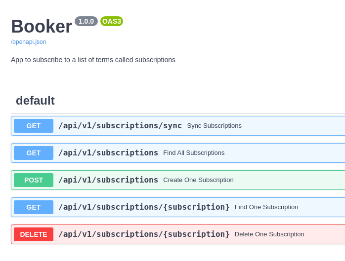

# Booker (Book Subscriber) 

The idea behind **Booker** is to allow users to **subscribe** to a list of
terms (ideally authors but they can also be titles) called **subscriptions**.

Once **Booker** finds new books in Spain for a given **subscription** the user is notified by **email**.

## Instructions

- Build the booker image `make build`.
- Export the following env variables inside the container:
    - **GMAIL_PASS** from [here](https://myaccount.google.com/apppasswords).
    - **GMAIL_SENDER**.
    - **GMAIL_RECIEVER**.
    - **DATASCALE_HOST**.
    - **DATASCALE_USERNAME**.
    - **DATASCALE_PASSWORD**.
    - **DATASCALE_DATABASE**.
- Finally you can run **Booker** with `make run`

## Documentation

The endpoints documentation is located at [http://booker.pmareke.com/docs](http://booker.pmareke.com/docs)

## Test

You can run the tests with `make test`
